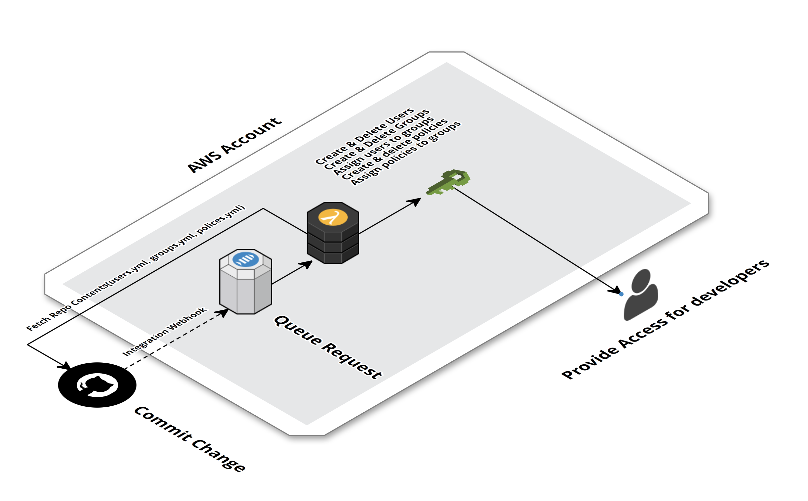

# aws-iam-manager

Manager your IAM Users, Roles, Groups and Policies using Github Repository with simple AWS Lambda function based on-top Serverless framework.

### Overview



Basing on repository contents, AIM will create users, attach them to specific groups with attached policies.

### Installation

1. ```npm install -g serverless@1.3.0```
2. Setup your AWS credentials in ```~/.aws/credentials```
3. Open ```serverless.yml``` and choose region where you'd like to deploy
4. Execute ```serverless deploy``` and wait for results.
5. Navigate to `https://console.aws.amazon.com/iam/home?region=<YOUR_REGION_NAME>#/users/GithubHookUser?section=security_credentials` and click `Create access key`. Wait couple seconds to generate and then download generated CSV file or copy `Access Key` & `Secret access key`. You'll need that data to setup Github hook.
6. Navigate to `https://console.aws.amazon.com/iam/home?region=<YOUR_REGION_NAME>#/users/GithubHookUser?section=permissions&policy=direct.githubhookuser.githubhookallowsnssubscriptionpolicy` and copy `Resource` value. It should something like this: `arn:aws:sns:us-east-1:YOUR_AWS_ACC_NUMBER:aws-iam-manager-dev-GithubNotifyTopic-xxxxx`.
7. Go to `https://github.com/YOUR_NAME/REPO/settings/hooks/new?service=amazonsns` and fill form with data you retrieved in steps 5 & 6. Lastly, click `Add Service`.
8. Now `aws-iam-manager` will continiously monitor your GitHub repo and reflect changes on AWS account.

### Repository Structure
##### Files structure

```
/repo_root
├── users.yml
├── groups.yml
└── policies.yml
```

`users.yml`
```
users:
  - sample.user
  - another.user
```

`policies.yml`
```
policies:
  - name: s3-list-bucket-access-policy
    document:
      Version: '2012-10-17'
      Statement:
        Effect: Allow
        Action: s3:ListBucket
        Resource: arn:aws:s3:::*
```

`groups.yml`
```
groups:
  - name: developers
    policy: s3-list-bucket-access-policy
    users:
      - sample.user
  - name: developers-two
    policy: s3-list-bucket-access-policy
    users:
      - another.user
```

Following setup will create two users, two groups and one policy. User `sample.user` will be joined to `developers` group while `another.user` will be joined to `developers-two` group. Both groups will receive rights to perform `list-buckets` action on all S3 Buckets because of attached `s3-list-bucket-access-policy` policy.


### Private Repositories
In case your repository is private you need to include `access_token` in every request to Github API. To do that, generate new Personal Access Token, copy `secrets.yml.example` to `secrets.yml` (or run `npm run prepare-secrets`) and paste there.

### Local Development
For ease and speed of development it's highly recommended to test code locally using ```npm run invoke``` script which will run function locally with data from `event.json`.

For nicer output you should also consider installing `bunyan` globally. If not, feel free to remove `| bunyan` part from `package.json`.
